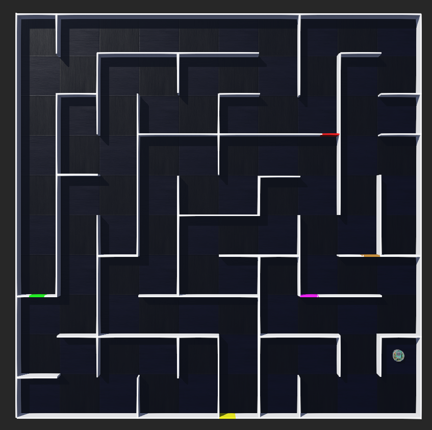
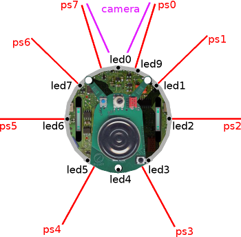
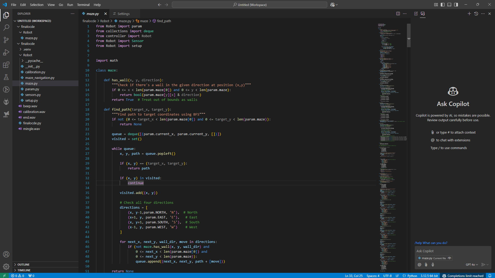
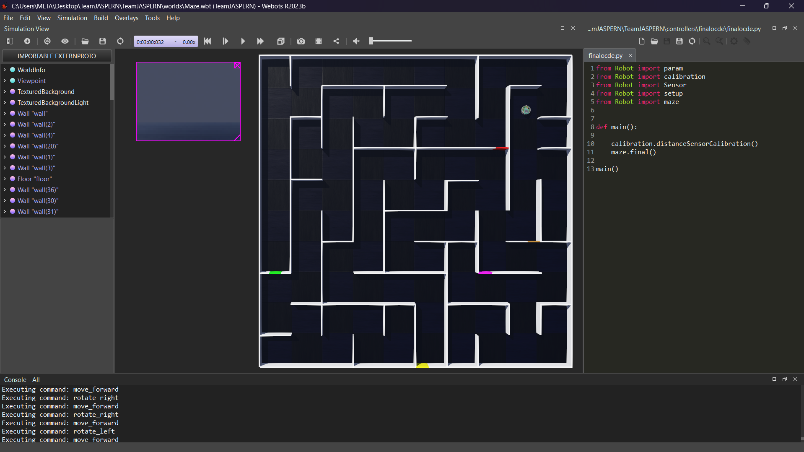

<h1 align="left">🤖 Webots---Maze Solving Robot Simulation</h1>

<h1 align="left">🌟 Introduction</h1>

This project was developed for the **IESL RoboGames 2024** competition, under the **University Category**, organized by the **Department of Computer Science and Engineering (CSE), University of Moratuwa**, in collaboration with the **Institution of Engineers, Sri Lanka (IESL).** The RoboGames is an annual robotics competition designed to inspire innovation, foster knowledge sharing, and showcase cutting-edge solutions in robotics engineering.

<h1 align="left">🎯 Project Objective:</h1>

The primary objective of this project was to design and program an e-puck robot to successfully navigate a customized Webots simulation arena. The task requirements, as specified in the competition guidelines, included:

- **Arena Design**: Building a 2.5m x 2.5m Webots environment following strict specifications for wall dimensions and spacing, with colored walls representing key waypoints.
- **Navigation Task**: Programming the robot to visit walls in the specified color sequence: **Red -> Yellow -> Pink -> Brown -> Green.**
- **Dynamic Starting** Position: Ensuring the robot could complete the task regardless of its initial placement within the arena.
- **Completion Criteria**: The robot must stop after completing the required sequence.

<h1 align="left">⚙️ Technical Details</h1>

<h2 align="left">🗺️ Arena Specifications</h2>

This project features a custom maze arena designed in Webots, adhering to the given specifications. The arena consists of carefully placed wall and floor nodes to create the maze's structure. The maze is intended to be used in robotics simulations, where a robot navigates through the maze to complete specific tasks. The design ensures the maze can be dynamically explored by robots using sensors for wall detection and pathfinding.

- Dimensions: 2.5m x 2.5m grid.
- Wall Specifications:
  - Height: 0.1m
  - Breadth: 0.01m
  - Length: Multiples of 0.25m
  - Colors: Red (#FF0000), Yellow (#FFFF00), Pink (#FF00FF), Brown (#A5691E), Green (#00FF00)

  

<h1 align="left">🤖 Robot Platform</h1>

The simulation utilized the **e-puck robot**, an ideal platform for academic and research purposes due to its built-in sensors and compact design.

  

<h1 align="left">🛠️ Tools and Frameworks</h1>

- **Webots Simulation Software**: To design the arena and simulate robot behavior.
- **Programming Language**: Python
- **Sensor Utilization**: proximity sensors and encoders
- **Visual Studio Code (VS Code)**: Used as the primary code editor for writing and debugging Python code in this project.

  

  

<h1 align="left">🎬 Final Demonstration</h1>

This section includes a simulation of the maze-solving robot in action and a final demonstration showcasing the robot's performance.

You can watch the video of the simulation and final demonstration using the link below:

[Watch the Video 🎥](https://drive.google.com/file/d/1Q1Q3jS-sYr_7IDePtnVnlqTTL20dpCtE/view)

<h1 align="left">🚧 Challenges Faced</h1>

- Ensuring the robot's navigation was robust across different starting positions.
- Fine-tuning the robot’s movement to precisely align with the required waypoints.
- Designing an arena that adhered to strict dimensional requirements while ensuring high simulation accuracy.

<h1 align="left">🏁 Conclusion</h1>

This project successfully demonstrates the use of Webots for simulating a maze-solving robot. The arena was carefully designed, and the robot's navigation was implemented using proximity sensors and encoders, enabling efficient obstacle detection and pathfinding. Tools like Visual Studio Code and Python facilitated seamless coding and debugging, while the simulation validated the robot's ability to meet the given task requirements. The inclusion of a final demonstration highlights the project’s effectiveness and potential for further development in robotics and autonomous navigation systems.

<h3 align="left">🤝 This project was proudly developed by TEAM JASPERN Creations as part of the IESL RoboGames 2024 competition.</h3>
